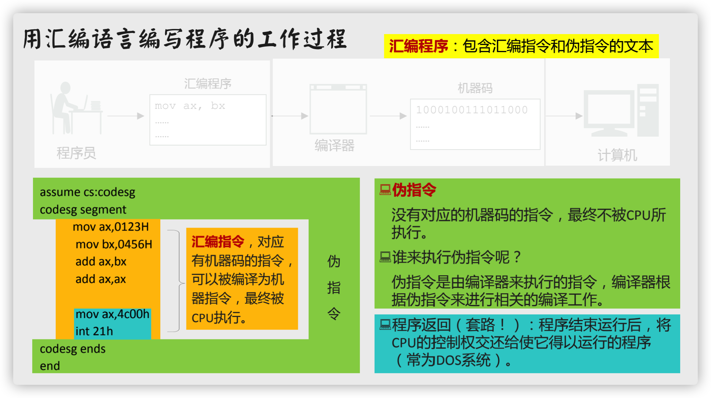
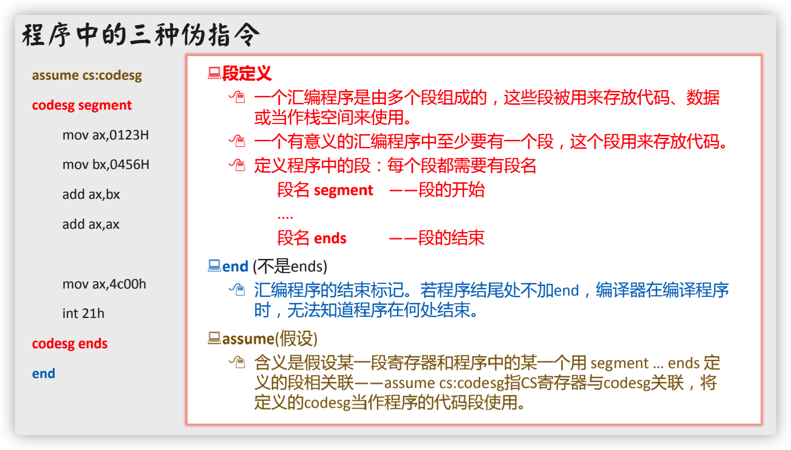
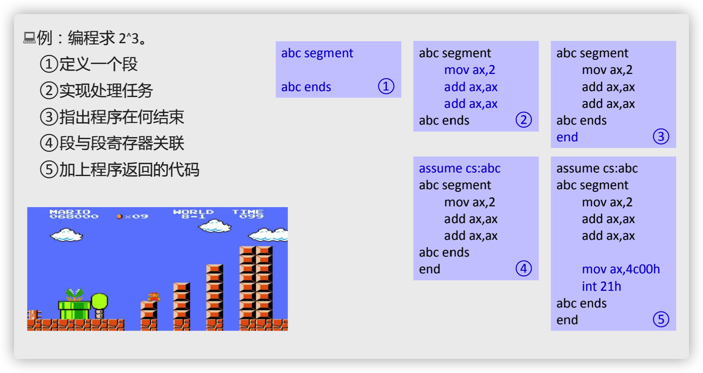
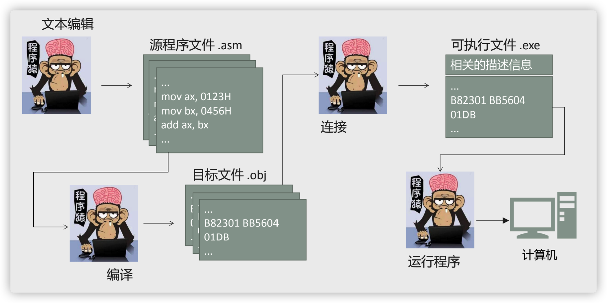
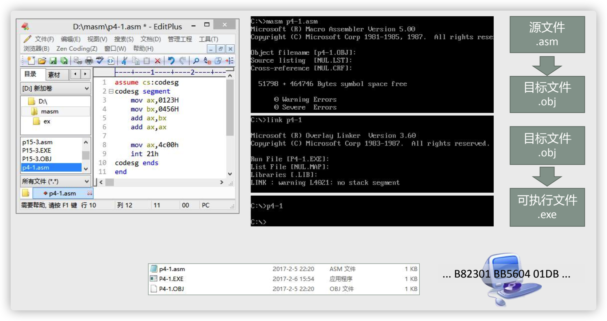

# 汇编源程序

## 用汇编语言写源程序

###  汇编语言编写程序的工作过程

###  程序中的三种伪指令

### 汇编程序的结构

* Debug 中直接写入指令的汇编程序
* 单独编写成源文件后再编译为可执行文件的程序
  * 适用于编写大程序。
  * 需要包括汇编指令，还要有指导编译工作的伪指令。
  * 源程序由一些段构成，这些段存放代码、数据或将某个段当作栈空间。
  * 注释：;(分号)

###  如何写出一个程序

## 由源程序到程序运行

### 运行和跟踪

