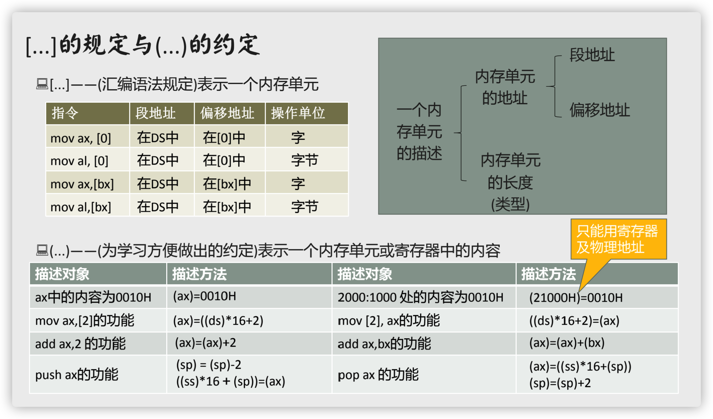
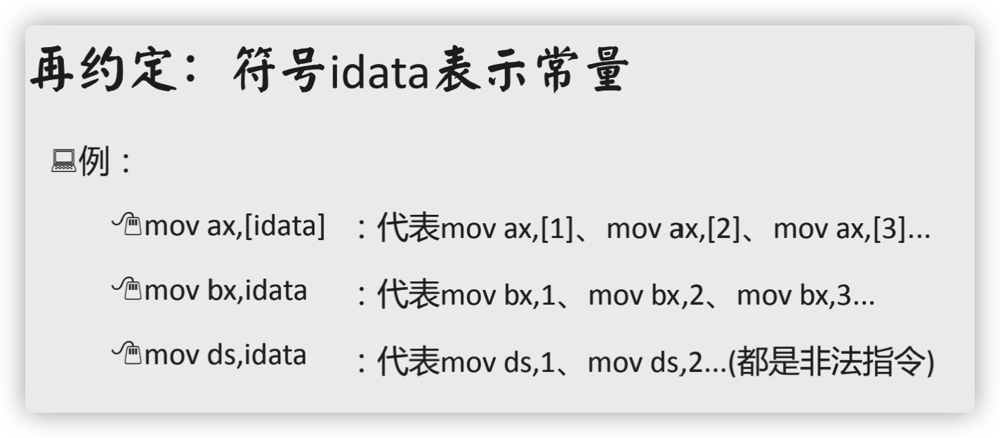
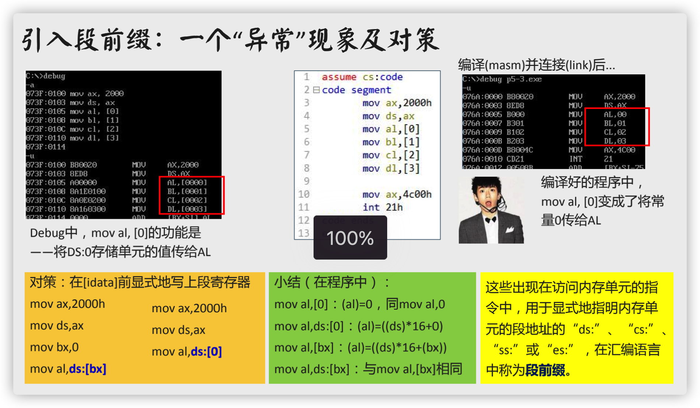
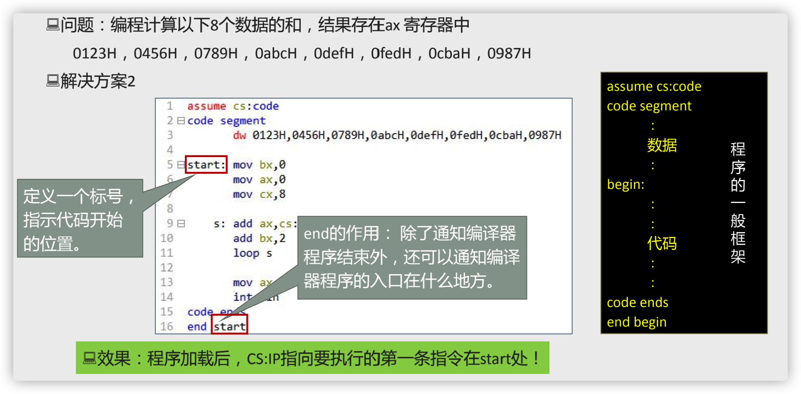
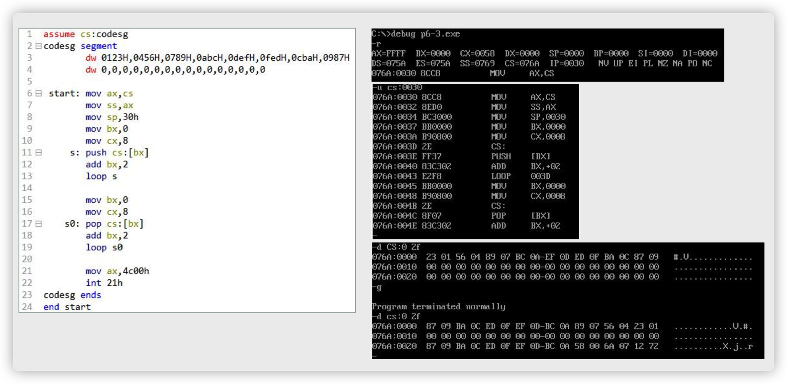
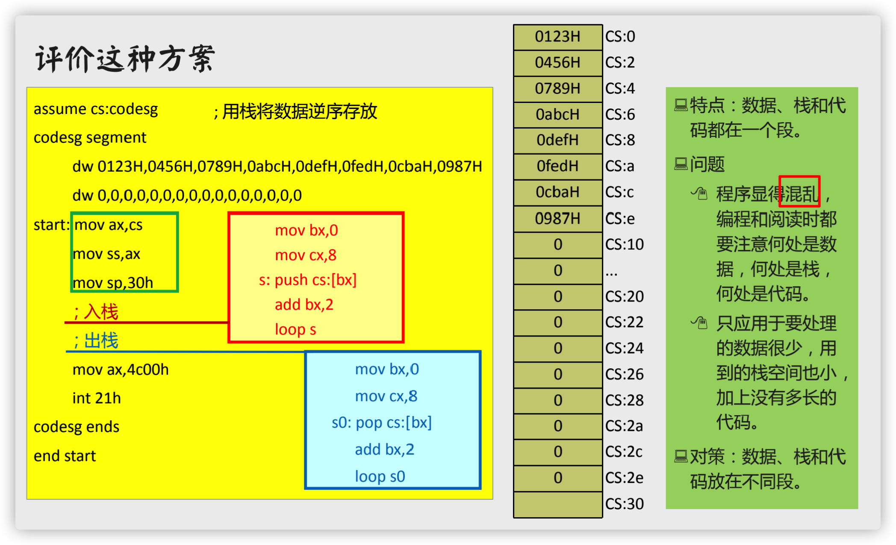
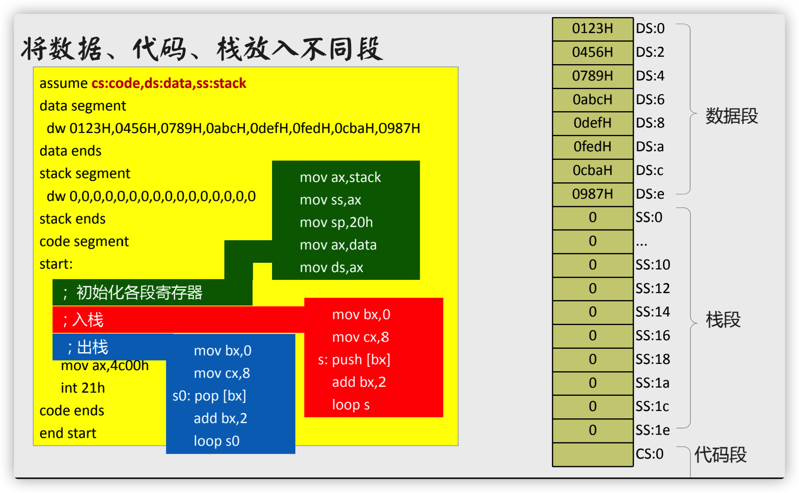

# 汇编源程序

## 用汇编语言写源程序

###  汇编语言编写程序的工作过程

###  程序中的三种伪指令

### 汇编程序的结构

* Debug 中直接写入指令的汇编程序
* 单独编写成源文件后再编译为可执行文件的程序
  * 适用于编写大程序。
  * 需要包括汇编指令，还要有指导编译工作的伪指令。
  * 源程序由一些段构成，这些段存放代码、数据或将某个段当作栈空间。
  * 注释：;(分号)

###  如何写出一个程序

## 由源程序到程序运行

### 运行和跟踪

## [...]和(...)

## Loop 指令

* 实现循环(计数型循环)

* loop 标号

* CPU 执行 loop 指令时要进行的操作

  * (cx)=(cx)-1 // cx-计数寄存器，count register

  * 判断cx中的值

    不为零则转至标号处执行程序

    如为零则向下执行

## 段前缀

## 在代码段中使用数据

在程序中直接写地址是非常危险的。

## 将数据、代码、栈放入不同的段

