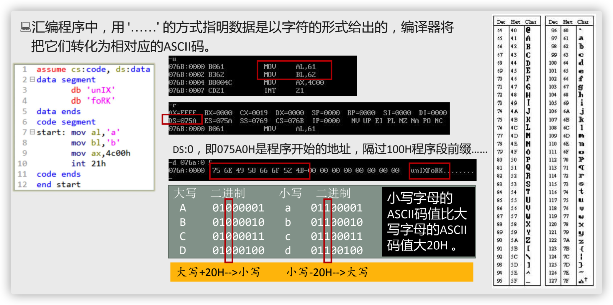
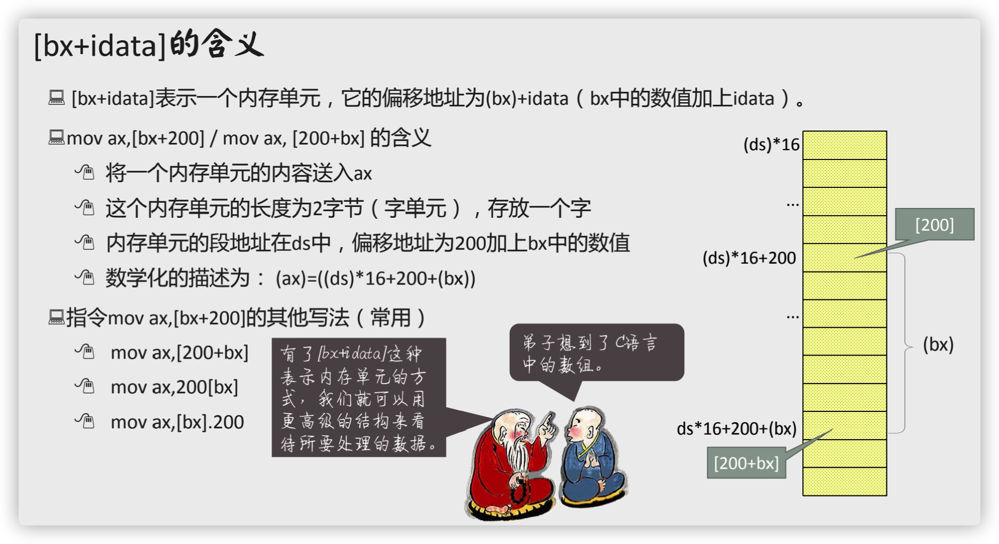
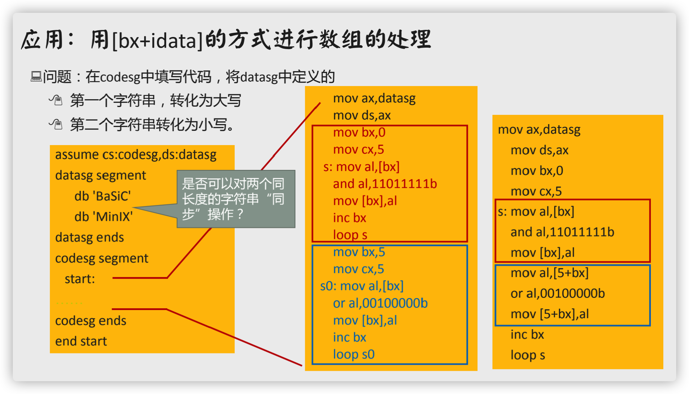
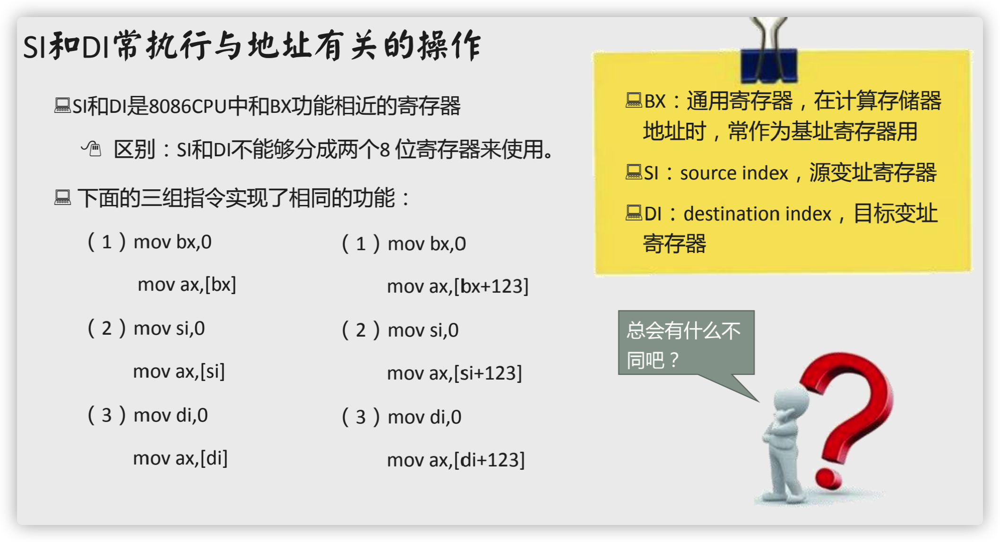
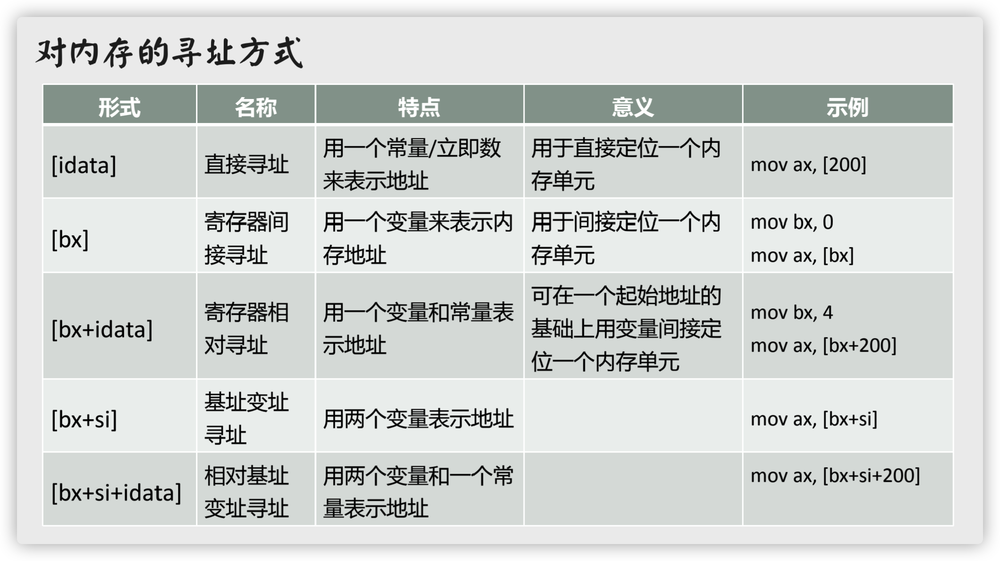

# 更灵活地定位内存地址

## 处理字符问题

## [bx+idata]方式寻址

## SI和DI寄存器

变址寄存器：SI、DI

## 不同寻址方式的灵活应用

[不同寻址方式演示](https://www.bilibili.com/video/BV1Wu411B72F/?p=38&spm_id_from=pageDriver&vd_source=d7d3114e5e6adfa296ffdf3dab44c281)