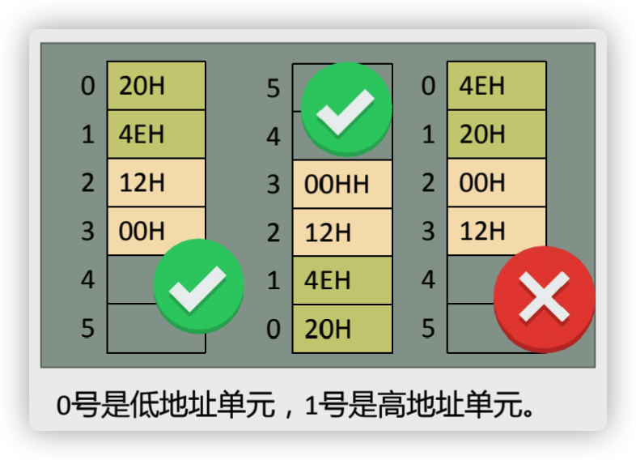

# 寄存器——内存访问

## 内存中字的存储

* 对8086CPU，16位作为一个字，16位字存储在一个16位的寄存器，高8位放高字节，低8位放低字节。

  

* 16位的字在内存中需要2个连续字节存储，低位字节存放在低地址单元，高位字节存放在高地址单元。

  * 例：20000D(4E20)存放0、1两个单元，18D(0012H)存放2、3两个单元。

  

## 字单元

字单元：由两个地址连续的内存单元组成，存放一个字型数据(16位)。

## 用 DS 和 [address] 实现字的传递

CPU要读取一个内存单元的时候，必须先给出这个内存单元的地址；

* 在8086CPU中，内存地址由段地址和偏移地址组成(段地址:偏移地址)

* 由 DS 寄存器和 [address] 配合

  * 用 DS 寄存器存放要访问的数据的段地址。

  * 偏移地址用[...]形式给出。

    *[0]表示DS*

    

    

## DS 和数据段

### 对内存单元中数据访问

* 对于8086CPU，可以根据需要将一组内存单元定义为一个段。

  * 物理地址=段地址*16 + 偏移地址

  * 将一组长度为N(N≤64k)、地址连续、起始地址为16的倍数的内存单元当作专门存储数据的内存空间，从而定义了一个数据段。

    

### 用 mov、add、sub 指令操作数据

## 栈

栈只能在一端进行插入或删除操作的数据结构。

* 入栈：将一个新的元素放到栈顶。
* 出栈：从栈顶取出一个元素。

CPU 如何知道一段空间被当作栈使用？

* 8086CPU中，有两个与栈相关的寄存器
  * 栈段寄存器SS：存放栈顶的段地址
  * 栈顶指针寄存器SP：存放栈顶的偏移地址
  * 任意时刻，**SS:SP 指向栈顶元素**。

* 当栈满的时候再使用push指令入栈，将发生栈顶越界问题。
* 当栈空的时候再使用pop指令出栈，将发生栈顶越界问题。

## 关于段的总结

