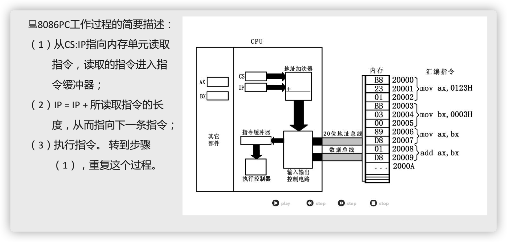

# 寄存器

## 寄存器是 CPU 内部的信息存储单元

### 8086 CPU 有14个寄存器

* 通用寄存器：AX、BX、CX、DX
* 变址寄存器：SI、DI
* 指针寄存器：SP、BP
* 指令寄存器：IP
* 段寄存器：CS、SS、DS、ES
* 标志寄存器：PSW

8086 CPU 所有寄存器都是 16 位的，可以存放两个字节。

### 通用寄存器——以AX为例

* 一个 16 位寄存器存储一个16位的数据

  

* 通用寄存器均可以分为两个独立的8位寄存器使用。

  

### "字"在寄存器中的存储

* 8086 是 16位 CPU，8086 的**字长(word size)**为 16 bit

* 一个**字(word)**可以存放在一个16位寄存器中。

  * 这个字的高位字节存放在这个寄存器的高8位寄存器

  * 这个字的低位字节存放在这个寄存器的低8位寄存器

    

## mov 和 add 指令


## 物理地址

* CPU 访问内存单元时要给出内存单元的地址。

* 所有的内存单元构成的存储单元是一个一维的线性空间。

* 每一个内存单元在这个空间中都有唯一的地址，这个唯一的地址称为**物理地址**。

  

### 8086 CPU 物理地址的方法

* 8086 有20位地址总线，可传送20位地址，**寻址能力为1M**。
* 8086 是16位结构的 CPU
  * 运算器一次最多可以处理16位的数据，寄存器的最大宽度为16位。
  * 在8086内部处理的、传输、暂存的地址也是16位，**寻址能力只有64KB**。

#### 8086 CPU 的解决方法

* 用两个16位地址(段地址、偏移地址)合成一个20位的物理地址。

* 地址加法器合成物理地址的方法

  * 物理地址= 段地址*16 + 偏移地址

  


如图，加法器会根据段地址和偏移地址计算出物理地址。

## 内存的分段表示法

* 8086CPU用“（段地址×16）+偏移地址=物理地址”的方式给出内存单元的物理地址，使得我们可以用分段的方式来管理内存。
* 内存并没有分段，段的划分来自CPU。


### 用不同的段地址和偏移地址形成同一个物理地址


## CS、IP和代码段

* CS：代码段寄存器
* IP：指令指针寄存器
* CS:IP ：CPU 将内存中CS:IP指向的内容当做指令执行。




## jmp 指令

可以通过改变CS、IP中的内容，来控制CPU要执行的目标指令。

### 转移指令 jmp

* 同时修改CS、IP的内容

  jmp 段地址:偏移地址

  ```assembly
  jmp 2AE3:3
  jmp 3:0B16
  ```

* 仅修改IP的内容

  jmp 某一合法寄存器

  ```assembly
  jmp ax （类似于 mov IP, ax）
  jmp bx 
  ```

  